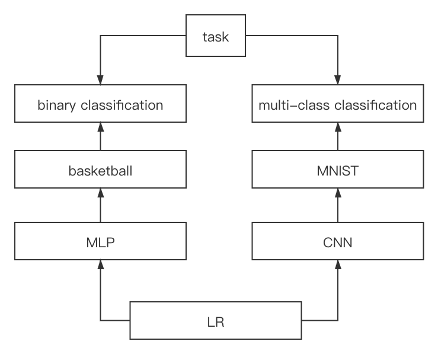

DeepLearning_Summar Code Documantation
===========================
该文件为本工程的说明文档。本工程不调用框架地完成了LR，MLP和CNN网络，并用多分类和二分类网络实验。
<div align=center></div>

****
    
<div align=center>
|Project|Deep Learning Frameworks|
|---|---
|Author|DUNBUJODA
</div>

****
## 目录
* [lr.py](#lr.py)
* [MLP_MNIST.py](#MLP_MNIST.py)
* [MLP_basketball.py](#MLP_basketball.py)
* [CNN_faster_mnist.py](#CNN_faster_mnist.py)
* [CNN_faster_basketball.py](#CNN_faster_basketball.py)

lr.py
-----
实现LR框架，并完成多分类和二分类任务。
```
class Model:
    def __init__(self, dim):  # parameters
    def sigmoid(self, z)  # activator
    def propagate(self, X, Y, flag)  # forward propagation
    def propagate_ROC(self, X, Y, k)  # forward propagation for calculating predictions
    def gradient_descent(self, A, X, Y)  # back propagation
    def optimize(self, dtheta, X, Y, cost)  # update parameters
    def split_trainingdata(self, X, Y)  # split training set
    def save_model(self, dir)  # save parameters of the model
    def calculate_ROC(self, X, Y)  # calculate recall & FAR
    def load_model_cal_ROC(self, dir, X, Y)  # load parameters of the model and calculate ROC
    def train(self, X_train, Y_train, X_val, Y_val, X_test, Y_test, dir)  # train the model
```
train the model
```
model.train(X_train, Y_train, X_val, Y_val, X_test, Y_test, dir)
```

MLP_MNIST.py
-----
实现MLP框架，并完成MNIST的多分类任务。实验结果与theano框架相同。
```
class HiddenLayer(object):  # hidden layers
    def __init__(self, input_size, output_size, learning_rate, activator, L2_reg, rng: np.random.RandomState = None)
    def forward(self, X)
    def backward(self, W_lplus1, delta_lplus1)
    def upgrade(self)
```
```
class OutputLayer():
    def __init__(self, input_size, output_size, learning_rate, L2_reg, rng: np.random.RandomState = None)
    def softmax(self, pred)
    def forward(self, X)
    def backward(self, Y)
    def upgrade(self)
```
```
class MLP(object):
    def __init__(self, input_size: int, hidden_layers: list, output_size: int)
    def propagate(self, X, Y, flag)
    def backpropagate(self, X, Y)
    def train(self, X_train, Y_train, X_val, Y_val, X_test, Y_test)
```

train the model
```
model = MLP(input_size=train_set_x.shape[0], hidden_layers=[500], output_size=10)
model.train(train_set_x, train_set_y, valid_set_x, valid_set_y, test_set_x, test_set_y)
```


MLP_basketball.py
-----
实现MLP框架，并完成篮球数据集的二分类任务。实验结果与theano框架相同。
```
class HiddenLayer(object):  # hidden layers
    def __init__(self, input_size, output_size, learning_rate, activator, L2_reg, rng: np.random.RandomState = None)
    def forward(self, X)
    def backward(self, W_lplus1, delta_lplus1)
    def upgrade(self)
```
```
class OutputLayer():
    def __init__(self, input_size, output_size, learning_rate, L2_reg, rng: np.random.RandomState = None)
    def softmax(self, pred)
    def forward(self, X)
    def backward(self, Y)
    def upgrade(self)
```
```
class MLP(object):
    def __init__(self, input_size: int, hidden_layers: list, output_size: int)
    def propagate(self, X, Y, flag)
    def backpropagate(self, X, Y)
    def train(self, X_train, Y_train, X_val, Y_val, X_test, Y_test)
    def save_weights(self)  # save the model
    def load_weights(self)  # load the model
    def propagate_ROC(self, thr, threshold, k)  # propagation of ROC curve
    def draw_and_save_ROC(self, X, Y)  # calculate recall & FAR and then save it
```

train the model
```
model = MLP(input_size=train_set_x.shape[0], hidden_layers=[20, 8], output_size=2)
# model.train(train_set_x, train_set_y, valid_set_x, valid_set_y, test_set_x, test_set_y)
model.draw_and_save_ROC(test_set_x, test_set_y)
```


CNN_faster_mnist.py
-----
实现CNN框架，并完成MNIST的多分类任务。CNN用fft加速。
```
class LeNetConvPoolLayer(object):
    def __init__(self, rng, input_shape, filter_shape, f_strides, padding,
    pooling, pooling_shape, p_strides, ignore_border,
    activator, learning_rate, name: str, L2_reg: float):
    def corr2d(self, X, W)
    def split_max_pooling(self)
    def concatenate_max_pooling(self, x)
    def forward_fft(self, X)
    def forward(self, X)
    def create_mask(self, x)
    def distribute(self, x, delta)
    def backward_fft(self, para, delta_prev)
    def backward(self, para, delta_prev)
    def upgrade(self)
```
```
class CNN(object):
    def __init__(self, convs:list, hiddens:list, output:OutputLayer, batch_size, epochs)
    def propagate(self, X, Y, flag)
    def backpropagate(self, X, Y)
    def train(self, X_train, Y_train, X_val, Y_val)
    def save_weights(self)
    def load_weights(self)
    def propagate_ROC(self, thr, threshold, k)
    def draw_and_save_ROC(self, X, Y)
    
```
functions
```
def build_model()  # define the architecture of CNN
```
train the model
```
convs, hiddens, op, batch_size, epochs = build_model()
model = CNN(convs=convs, hiddens=hiddens, output=op, batch_size=batch_size, epochs=epochs)
model.train(train_set_x, train_set_y, valid_set_x, valid_set_y)
```

CNN_faster_basketball.py
-----
实现CNN框架，并完成篮球数据集的二分类任务。CNN用fft加速。
```
class LeNetConvPoolLayer(object):
    def __init__(self, rng, input_shape, filter_shape, f_strides, padding,
    pooling, pooling_shape, p_strides, ignore_border,
    activator, learning_rate, name: str, L2_reg: float):
    def corr2d(self, X, W)
    def split_max_pooling(self)
    def concatenate_max_pooling(self, x)
    def forward_fft(self, X)
    def forward(self, X)
    def create_mask(self, x)
    def distribute(self, x, delta)
    def backward_fft(self, para, delta_prev)
    def backward(self, para, delta_prev)
    def upgrade(self)
```
```
class CNN(object):
    def __init__(self, convs:list, hiddens:list, output:OutputLayer, batch_size, epochs)
    def propagate(self, X, Y, flag)
    def backpropagate(self, X, Y)
    def train(self, X_train, Y_train, X_val, Y_val)
    def save_weights(self)
    def load_weights(self)
    def propagate_ROC(self, thr, threshold, k)
    def draw_and_save_ROC(self, X, Y)
    
```
functions
```
def build_model()  # define the architecture of CNN
```
train the model
```
convs, hiddens, op, batch_size, epochs = build_model()
model = CNN(convs=convs, hiddens=hiddens, output=op, batch_size=batch_size, epochs=epochs)
model.train(train_set_x, train_set_y, valid_set_x, valid_set_y)
```
